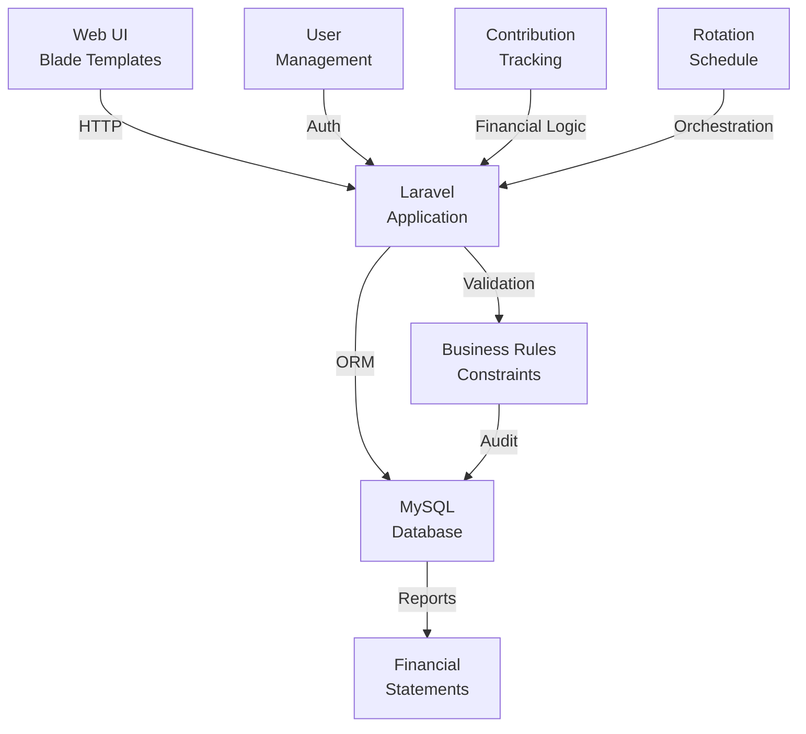

# Tontine SN

Financial management application for rotating savings associations (tontines) in Senegal. Complete business system integrating user management, contribution tracking, disbursement scheduling, and financial reporting.

## Overview

Web application designed to digitize and formalize rotating savings and credit associations (tontines) operating in West Africa. Manages member participation, contribution collection, rotation scheduling, and financial reconciliation with audit trail and governance controls.

## System Architecture



## Quick Start

```bash
docker compose up -d
```

Manual setup:

```bash
composer install
cp .env.example .env
php artisan key:generate
php artisan migrate
php artisan serve
```

Application available at http://127.0.0.1:8000

## Tech Stack

| Layer | Technology |
|-------|------------|
| Framework | Laravel (PHP) |
| Frontend | Blade templates, Tailwind CSS |
| Database | MySQL 8.0 |
| ORM | Eloquent |
| Validation | Laravel validation rules |
| Authentication | Laravel Auth |
| Migrations | Laravel migrations |
| Testing | PHPUnit |

## Key Features

- **Member Management** : registration, profiles, financial history
- **Contribution Tracking** : payment scheduling, confirmation, reconciliation
- **Rotation Scheduling** : automatic rotation sequence, disbursement dates
- **Financial Reporting** : transaction history, balance sheets, audit reports
- **User Roles** : administrator, treasurer, member with permission controls
- **Data Validation** : business rules enforcement (contribution amounts, dates, quorum)
- **Audit Trail** : transaction logging for governance compliance

## Repository Structure

```
app/
├── Models/              # Eloquent models (User, Tontine, Contribution, etc.)
├── Http/                # Controllers, requests, middleware
├── Services/            # Business logic (RotationService, FinanceService)
└── Rules/               # Custom validation rules
database/
├── migrations/          # Schema definitions
├── seeds/               # Initial data
└── factories/           # Test data generation
resources/
├── views/               # Blade templates
├── css/                 # Styling
└── js/                  # Frontend logic
routes/                  # API and web routes
tests/                   # PHPUnit test suite
```

## Database Schema

Key tables:
- `users` : member profiles and authentication
- `tontines` : rotating savings group definitions
- `contributions` : payment records and schedules
- `rotations` : disbursement sequence and status
- `transactions` : audit trail of all financial movements

## Development

Install dependencies:

```bash
composer install
```

Run tests:

```bash
php artisan test
```

Database migrations:

```bash
php artisan migrate
php artisan migrate:refresh --seed
```

## Compliance & Governance

- **Contribution Validation** : enforces configured amounts, prevents overpayment
- **Rotation Rules** : immutable rotation sequence, prevents out-of-order disbursement
- **Audit Logging** : all transactions recorded with timestamp and actor
- **Permission Controls** : role-based access (admin, treasurer, member)
- **Data Integrity** : database constraints ensure consistency

---

**Status**: Production-ready application for tontine management in Senegal. Actively maintained.
